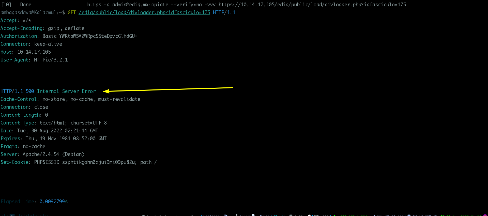
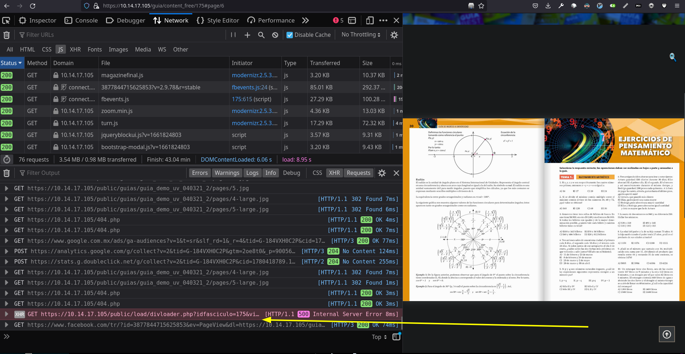
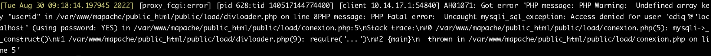
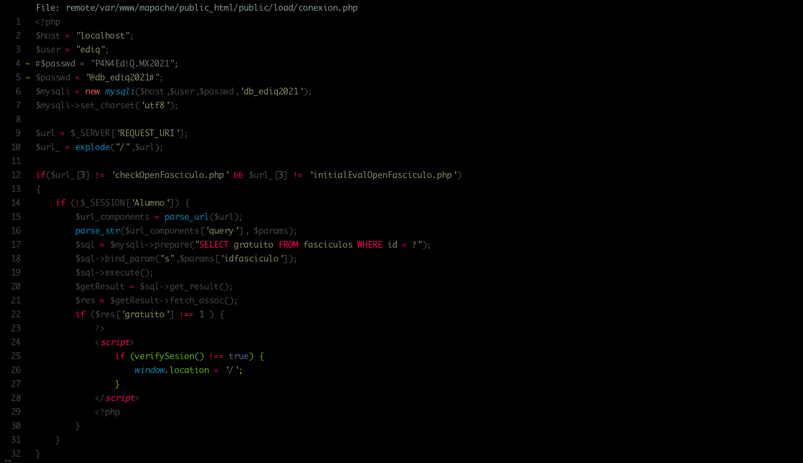
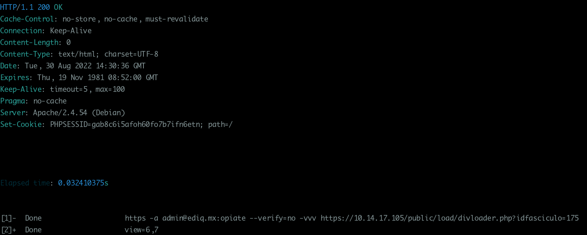
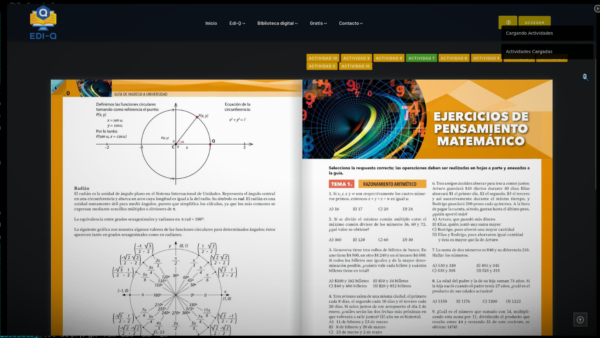

# Install

> For installation just run git

```bash
git clone --recurse-submodules git@github.com:EdiQ-mx/ediq.plataforma.git ./public_html
```

If you are in remote server :

You could do this by mounting the remote folder as a file-system using sshfs.
To do this, first some pre-requisites:

```bash
#issue all these cmds on local machine
sudo apt-get install sshfs
sudo adduser <username> fuse #Not required for new Linux versions
(including Ubuntu > 18.04)
```

Now, do the mounting process:

```bash
mkdir ~/remoteserv
sshfs -o idmap=user <username>@<ipaddress>:/remotepath ~/remoteserv
```

After this, just go into the mounted folder and use your own local customized vim.

---

## Problem

> During the migration of a web application, I got the below error while
> restoring a database
> on another server. The collation id may differ based on the MySQL version.

Error message:

```bash
Error 1273 (HY000) at line 25 Unknown collation: 'utf8mb4_0900_ai_ci'
```

See the error screenshot during database restoration.

 Unknown collation: 'utf8mb4_0900_ai_ci'")

---

## Here you go with a solution

### Solution

After a little investigation, I found that the MySQL server running on the
destination is an older version than the source.
So we got that the destination server doesn’t contain the required
database collation.

Then we do a little tweak in the backup file to resolve this.
Edit the database backup file in text editor and
replace “**utf8mb4_0900_ai_ci**” with “**utf8mb4_general_ci**”
and “**CHARSET=utf8mb4**” with “**CHARSET=utf8**“.

Replace the below string:

```bash
ENGINE=InnoDB DEFAULT CHARSET=utf8mb4 COLLATE=utf8mb4_0900_ai_ci;

```

with:

```bash
ENGINE=InnoDB DEFAULT CHARSET=utf8 COLLATE=utf8_general_ci;

```

Save your file and restore the database.

---

The Linux system users can use the
[sed command](https://tecadmin.net/example-of-find-and-replace-string-in-files-with-sed/)
to replace text in files directly.

```bash
sed -i 's/utf8mb4_0900_ai_ci/utf8_general_ci/g' backup.sql
# then ...
sed -i 's/utf8mb4/utf8/g' backup.sql
```

That it. after the above changes, the database was successfully restored!
Hope this is solution helped you to resolve
“**Unknown collation: ‘utf8mb4_0900_ai_ci’**” issue.:w

Then

```bash
mysql -u root -p < backup.sql
```

---

### Git Clones

> Some problems with some repos
> Load repo under public

```bash
git clone git@github.com:EdiQ-mx/ediq.load.git public/load
```

---

### Activities problem for loading

> There is a problem loading activities on books UI

The source link is broken:


---

In the UI :


---

Debugging Apache:



---

> After Debugging , the problem is caused because the conection
> config -> _conexion.php_ to the db
> is independent from the main configuration app file -> _Config.php_



---

So in this case change to proper configuration fix the issue:



---

Working UI

