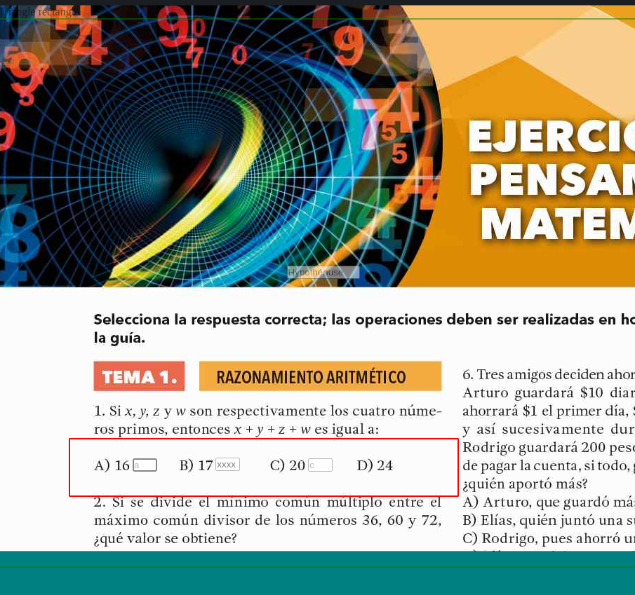
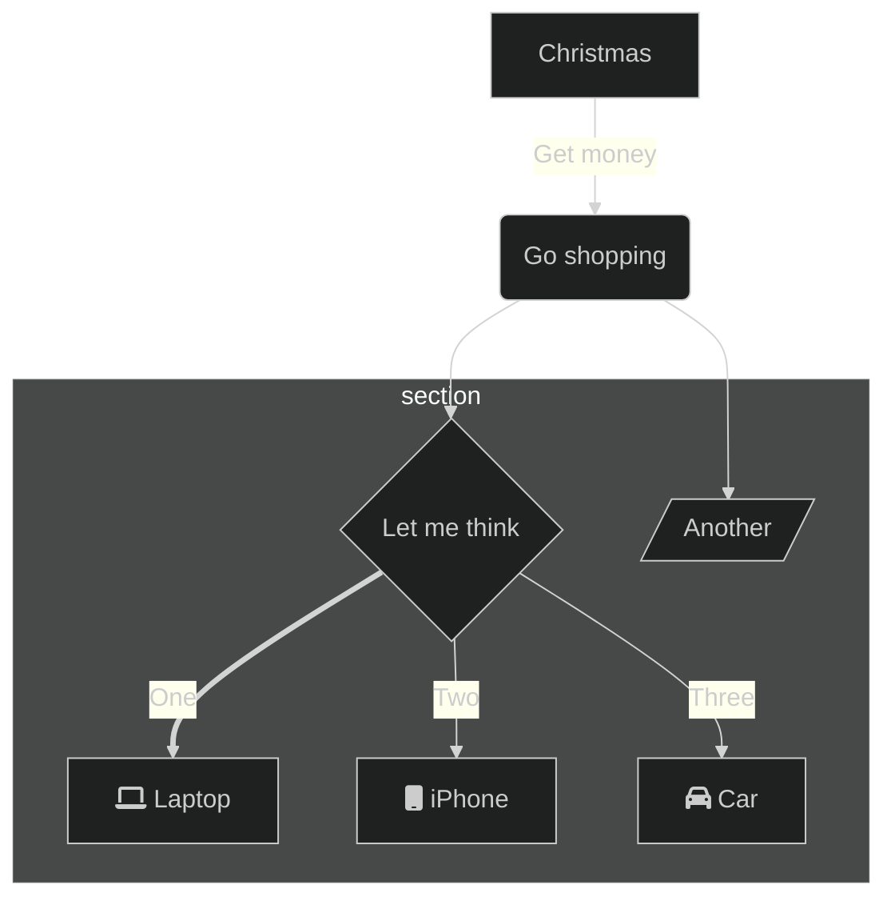

## Objetivo

- Diseñar e Implementar una interfaz interactiva que permita utilizar los libros de texto
  digitalizados como si se tratasen de los libros reales
- La interfaz debe permitir escribir las respuestas en los campos del libro digitalizado
- Conservar la estructura del Libro en su totalidad, Colores , Diseño , Tipografías , etc
- Integrarlo con el Desarrollo actual

---

## Planteamiento

- Agregar nuevas caracteristicas que permitan la interaccion con los libros digitalizados de la
  plataforma
- Crear un módulo para Administrar la informacion generada (Calificaciones,Maestros ,Alumnos)
- Crear un módulo que evalue las actividades de manera automatizada
- Crear un módulo que presente los resultados (Dashboard)
  

---

## Alcances del Proyecto

- Interfaz que Simula el uso natural de un libro
- Capacidad de responder los ejercicios del libro digitalmente
- Automatización del proceso de evaluacion de los alumnos que realicen  
  actividades en la plataforma digital
- Administración y presentación de la información procedente de los alumnos
  rapida y bien estructurada (Dashboard)

---

## Roadmap

Roadmap to Requirements

---

## Propuesta Económica

### Propuesta 1

> tiempo de desarrollo 6 meses

- Pago de equipo completo de desarrollo
- Anticipo del 50%
- Primer pago del 25%
- Segundo y último pago del 25%

[x] Total $182,000.00

### Propuesta 2

> tiempo de desarrollo 9 meses

- Pago mensual 2 desarrolladores
- $9,000 c/u

[] Total mensual $18,000.00

### Propuesta 3

> tiempo de desarrollo 18 meses

- Pago mensual 2 desarrolladores
- $5,055.00

[] Total mensual $10,111.00

---

## Firmas de conformidad

quim

dev_one

dev_two
