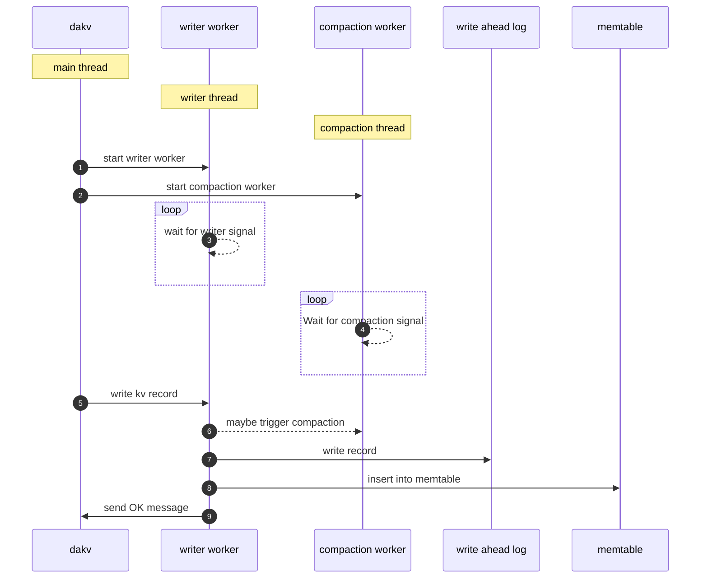
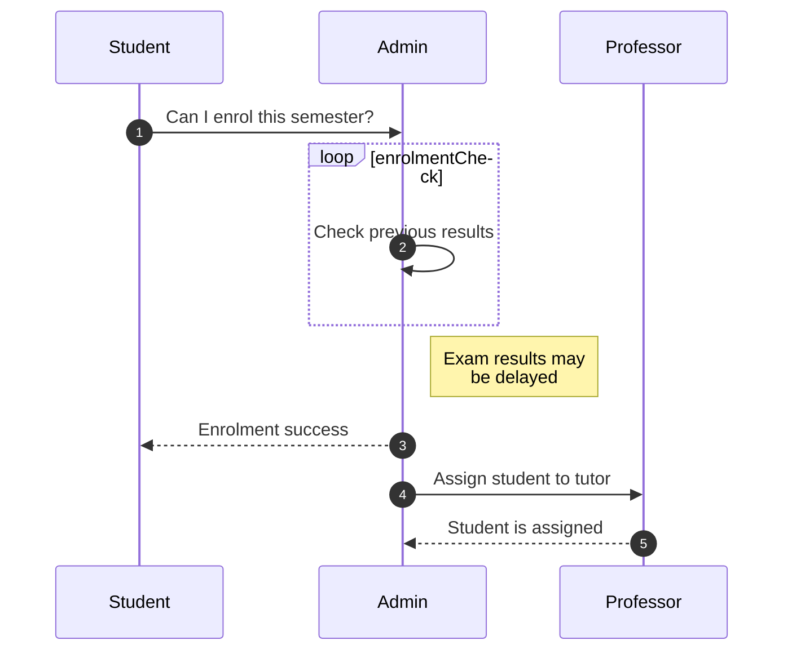
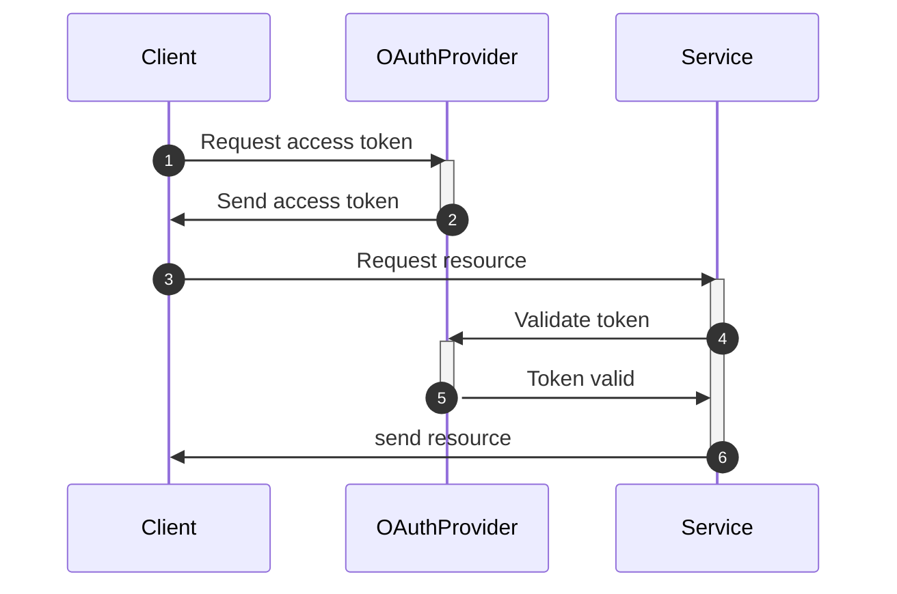
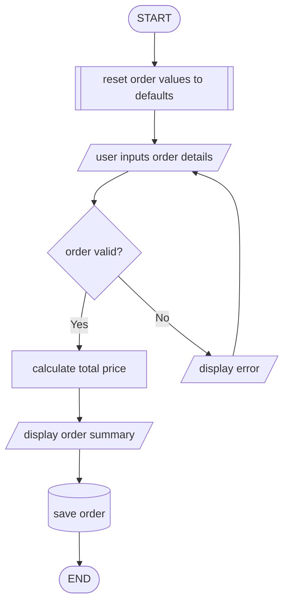
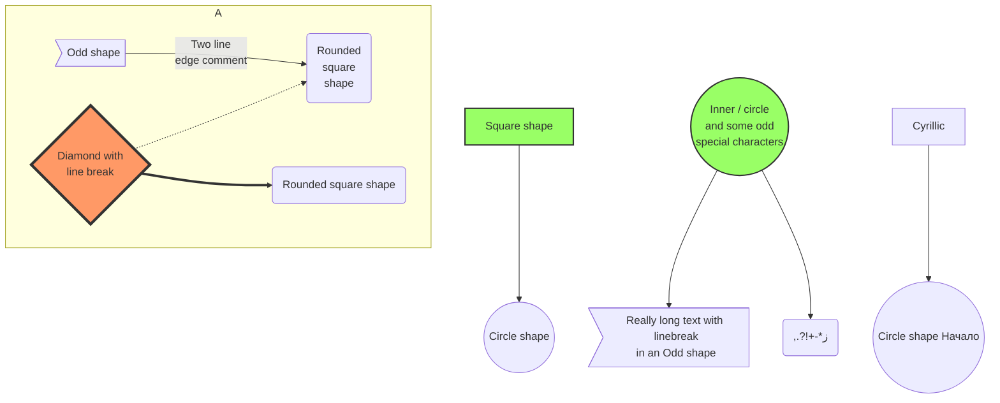
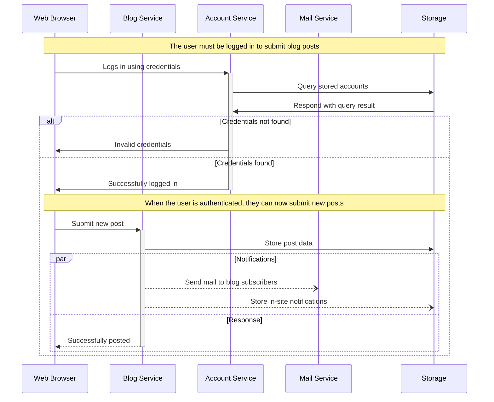

## Structure of BMS

> Flow Diagram



---



---

### Authentication Using OAuth Token



---

### Flowchart



---



---



---

### SMCAT

```smcat
eat   [color="#008800"],
sleep [color="blue" active],
meow  [color="red"],
play  [color="purple"];

sleep -> meow  [color="red"]            : wake up;
meow  -> meow  [color="red"]            : no response from human;
meow  -> eat   [color="#008800"]        : human gives food;
meow  -> play  [color="purple"]         : human gives toy;
play  -> sleep [color="blue"]           : tired or bored;
eat   -> sleep [color="blue" width=3.5] : belly full;
```
