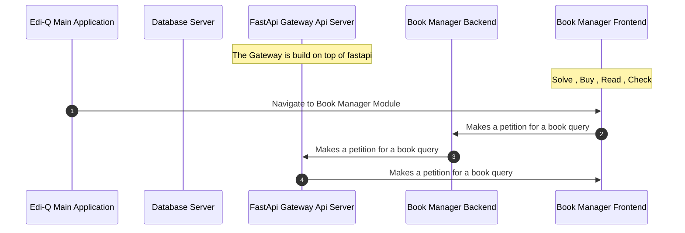

## Structure of BMS

```mermaid
sequenceDiagram
autonumber
    participant ediq as Edi-Q Main Application
    participant db as Database Server
    participant api as FastApi Gateway Api Server
    participant bms as Book Manager Backend
    participant bmsx as Book Manager Frontend

    Note over api : The Gateway is build on top of fastapi
    Note over bmsx : Solve , Buy , Read , Check

    ediq ->> bmsx : Navigate to Book Manager Module
    bmsx ->> bms : Makes a petition for a book query
    activate bms
    bms ->> api : Makes a petition for a book query
    api ->> bmsx : Makes a petition for a book query
```
